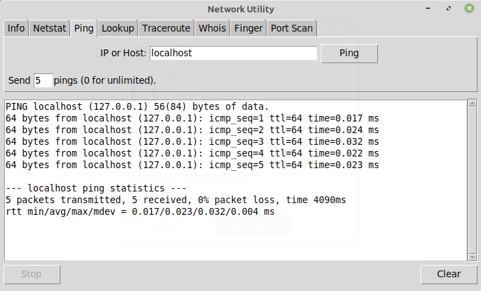

# network-utility

A simple GUI front-end for common command-line networking utilities, modeled more or less after the Network Utility that used to be included in Mac OS X. Written in Tcl using the Tk GUI toolkit.

## Compatibility

The program requires that the underlying utilities already be installed on the system.

| Tab | Utility |
| -- | -- |
| Info | `ifconfig` |
| Netstat | `netstat` |
| Ping | `ping` |
| Lookup | `dig` `host` `nslookup`  |
| Traceroute | `traceroute` |
| Whois | `whois` |
| Finger | `finger` |
| Port Scan | `nmap` |

## Acknowledgments

Uses [network icon](https://www.svgrepo.com/svg/157849/network) from [SVG Repo](https://www.svgrepo.com/).

## Authors

- J.C. Fields <jcfields@jcfields.dev>

## License

- [MIT license](https://opensource.org/licenses/mit-license.php)
